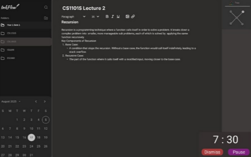

# InkFlow

A powerful, privacy-focused note-taking application built with Electron, React, and TypeScript. InkFlow combines traditional note-taking with AI assistance, audio transcription, and productivity tools to create a comprehensive digital workspace.



## 🚀 Features

### Core Features
- **📝 Notes Organizer**: Markdown-based note-taking with file system organization
- **📅 Calendar Integration**: Monthly calendar with daily notes and to-do lists
- **⏱️ Timer & Pomodoro**: Customizable timer for productivity techniques
- **🤖 AI Chatbot**: Intelligent chatbot for note assistance and transcription
- **🎤 Audio Transcription**: Real-time speech-to-text with AssemblyAI
- **🎨 Customizable UI**: Dark/light themes and personalized appearance

## 🛠️ Prerequisites

Before installing InkFlow, ensure you have the following dependencies:

- **Node.js** (v18 or higher)
- **Yarn** or **npm**
- **Ollama** (for AI chat functionality)
- **Sox** (for audio processing)

## 📦 Installation

### Quick Start

1. **Clone the repository**
   ```bash
   git clone <repository-url>
   cd InkFlow
   ```

2. **Install dependencies**
   ```bash
   yarn install
   ```

3. **Start the application**
   ```bash
   yarn dev
   ```

## 🖥️ Operating System-Specific Installation

### Windows

#### 1. Install Node.js
1. Download Node.js from [https://nodejs.org/](https://nodejs.org/)
2. Choose the LTS version (recommended)
3. Run the installer and follow the setup wizard
4. Verify installation:
   ```cmd
   node --version
   npm --version
   ```

#### 2. Install Yarn (Optional)
```cmd
npm install -g yarn
```

#### 3. Install Ollama
1. Download Ollama from [https://ollama.ai/download](https://ollama.ai/download)
2. Choose the Windows version
3. Run the installer
4. Start Ollama from the Start menu or run:
   ```cmd
   ollama serve
   ```
5. Download the required model:
   ```cmd
   ollama pull llama3.2
   ```

#### 4. Install Sox
1. Download Sox for Windows from [https://sourceforge.net/projects/sox/files/sox/](https://sourceforge.net/projects/sox/files/sox/)
2. Extract the downloaded file
3. Add Sox to your system PATH:
   - Copy `sox.exe` to a permanent location (e.g., `C:\Program Files\Sox\`)
   - Add the directory to your system PATH:
     - Right-click on "This PC" → Properties → Advanced system settings
     - Click "Environment Variables"
     - Under "System variables", find "Path" and click "Edit"
     - Click "New" and add the Sox directory path
     - Click "OK" to save
4. Verify installation:
   ```cmd
   sox --version
   ```

### macOS

#### 1. Install Node.js
**Option A: Using Homebrew (Recommended)**
```bash
# Install Homebrew if you don't have it
/bin/bash -c "$(curl -fsSL https://raw.githubusercontent.com/Homebrew/install/HEAD/install.sh)"

# Install Node.js
brew install node
```

**Option B: Direct Download**
1. Download Node.js from [https://nodejs.org/](https://nodejs.org/)
2. Run the macOS installer
3. Follow the setup wizard

Verify installation:
```bash
node --version
npm --version
```

#### 2. Install Yarn (Optional)
```bash
npm install -g yarn
```

#### 3. Install Ollama
```bash
# Install using Homebrew
brew install ollama

# Or download from https://ollama.ai/download
# Then run the installer

# Start Ollama
ollama serve

# Download the required model
ollama pull llama3.2
```

#### 4. Install Sox
```bash
# Install using Homebrew
brew install sox

# Verify installation
sox --version
```

### Linux (Ubuntu/Debian)

#### 1. Install Node.js
```bash
# Update package list
sudo apt update

# Install Node.js and npm
curl -fsSL https://deb.nodesource.com/setup_lts.x | sudo -E bash -
sudo apt-get install -y nodejs

# Verify installation
node --version
npm --version
```

#### 2. Install Yarn (Optional)
```bash
npm install -g yarn
```

#### 3. Install Ollama
```bash
# Download and install Ollama
curl -fsSL https://ollama.ai/install.sh | sh

# Start Ollama service
sudo systemctl start ollama

# Enable Ollama to start on boot
sudo systemctl enable ollama

# Download the required model
ollama pull llama3.2
```

#### 4. Install Sox
```bash
# Install Sox
sudo apt-get install sox

# Verify installation
sox --version
```

## 🔧 Troubleshooting

### Common Issues

#### 1. "Sorry, I couldn't generate a response" in Chat
**Cause**: Ollama is not running or the model is not downloaded
**Solution**:
```bash
# Start Ollama
ollama serve

# Download the model
ollama pull llama3.2

# Verify Ollama is running
curl http://localhost:11434/api/tags
```

#### 2. Audio Transcription Not Working
**Cause**: Sox is not installed or not in PATH
**Solution**:
- Verify Sox installation: `sox --version`
- Ensure Sox is in your system PATH
- Restart your terminal after adding Sox to PATH

#### 3. Backend Server Connection Error
**Cause**: The backend server (port 3001) is not running
**Solution**:
```bash
# Start the backend server separately
yarn start:server

# Or use the combined command
yarn dev
```

#### 4. Port Already in Use
**Cause**: Another application is using the required ports
**Solution**:
```bash
# Check what's using port 3001
lsof -i :3001

# Check what's using port 11434
lsof -i :11434

# Kill the process if needed
kill -9 <PID>
```

### Essential Commands

```bash
# Check if services are running
lsof -i :3001  # Backend server
lsof -i :11434 # Ollama

# Test Ollama API
curl http://localhost:11434/api/tags

# Check installations
node --version
yarn --version
ollama list
sox --version
```

## 📋 System Requirements

- **RAM**: Minimum 4GB, Recommended 8GB+
- **Storage**: At least 2GB free space
- **OS**: Windows 10+, macOS 10.15+, Ubuntu 18.04+
- **Node.js**: v18 or higher
- **Internet**: Required for initial model download

## 🎯 User Stories

- As a student, I can easily navigate the app to quickly find the notes I need.
- As a student, there will be an AI tool that helps to point out any mistakes (such as grammar, and spelling mistakes) while I am typing down my notes.
- As a user, I can upload videos to the app and generate video transcripts.
- As a user, I can navigate to the daily to-do list by expanding into the chosen date from the calendar.
- As a user, I can set a timer to record the amount of time I have spent on work and remind me to take breaks.
- As a user, I can customize the app's appearance to suit my preferences.

## 🏆 Project Achievement

**Apollo 11** - Level of Achievement

## 💡 Project Motivation

As a student, the hunt for a digital note-taking app is a tiring one. Either some are missing features or others have them locked behind a paywall. We want to bring these together within a single note-taking app for a user to experience a flexible but powerful note-taking app that covers most of a user's daily needs. We are hoping to combine features that no other note-taking Apps have done before.

## 🎯 Proposed Solution

To create a note-taking app that incorporates features that improve ease of use and easy access to stored information, without any worries of privacy.

## 📚 Core Features

- **Notes Organizer**: Utilizing Markdown text and file system to enable searching through and editing files with ease
- **Calendar**: Monthly calendar with the ability to take down daily notes, and create To-Do lists
- **Timer**: A modifiable timer that can be used as a reminder or for study techniques (like Pomodoro method)
- **AI Assistant**: A support chatbot to help streamline, translate or transcribe notes

## 🚀 Quick Start Checklist

- [ ] Node.js installed and verified
- [ ] Yarn or npm installed
- [ ] Ollama installed and running
- [ ] Llama3.2 model downloaded
- [ ] Sox installed and in PATH
- [ ] InkFlow dependencies installed
- [ ] Backend server running (port 3001)
- [ ] Chat functionality working
- [ ] Audio transcription working

## 📄 License

This project is licensed under the MIT License - see the [LICENSE](LICENSE) file for details.
